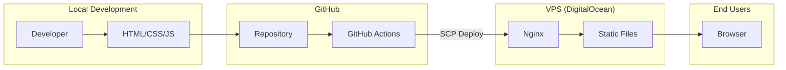
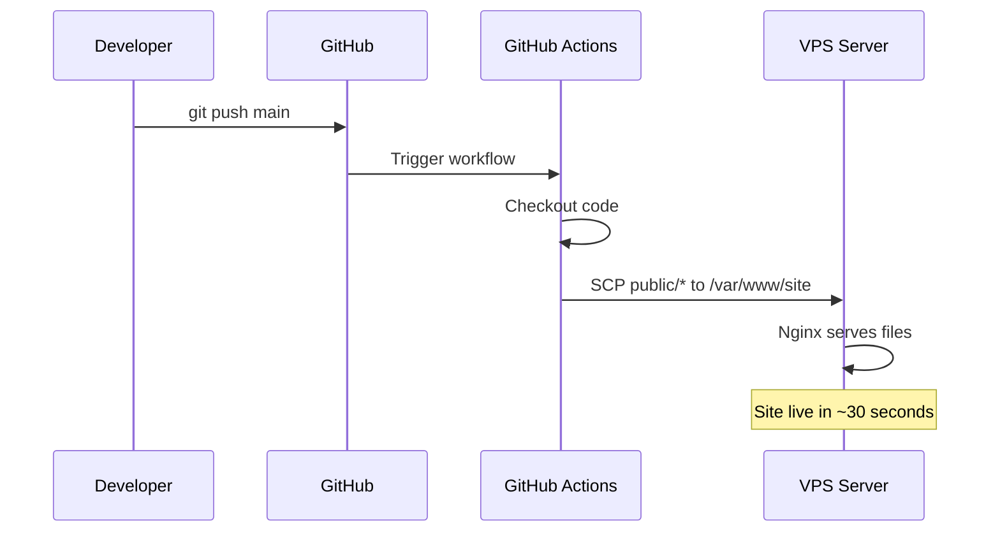
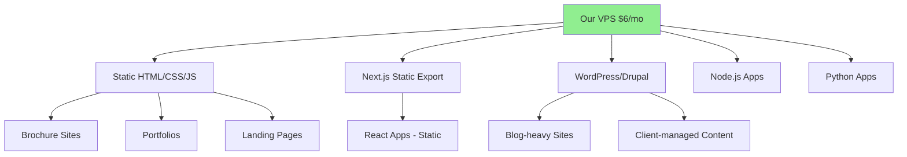
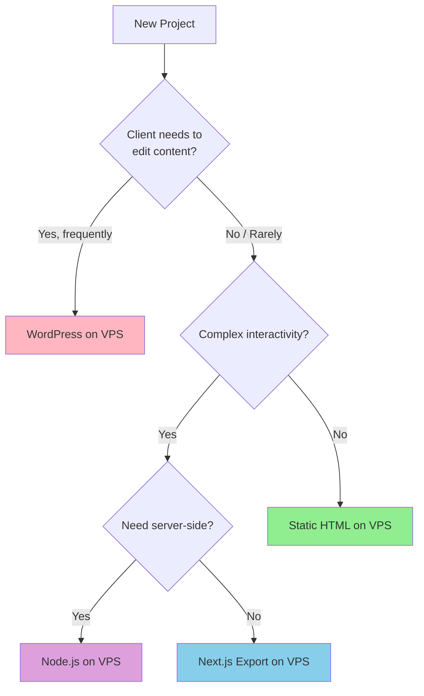
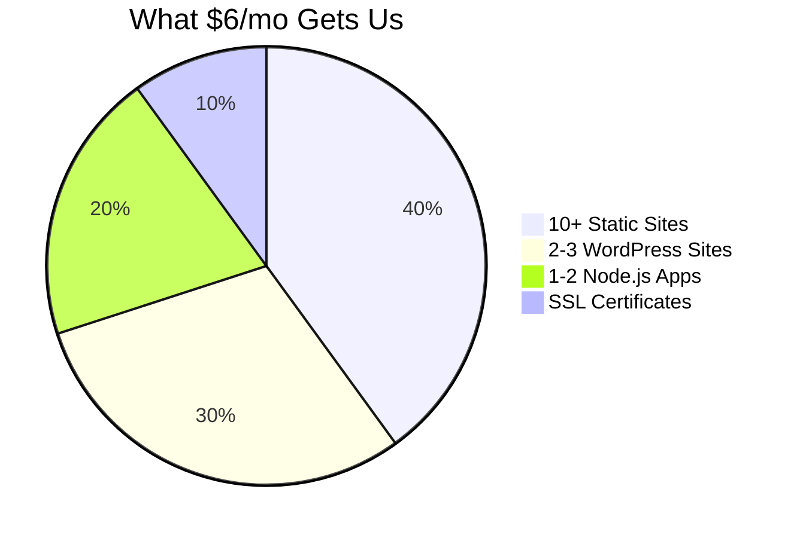

# Brochure Site Setup Guide

Standard setup for static brochure sites with auto-deployment to VPS.

## Architecture Overview



## Deployment Flow



## Our VPS-First Approach

We host everything on our VPS where possible. This maximizes value from our $6/mo droplet.

### What We Can Host on VPS



### When to Use Each Stack (All on VPS)

| Use Case | Stack | Deploy Method |
|----------|-------|---------------|
| Simple brochure site | Static HTML | SCP via GitHub Actions |
| Portfolio/gallery | Static HTML + Tailwind | SCP via GitHub Actions |
| Blog-heavy site | Static + JSON blog | SCP via GitHub Actions |
| Client edits content | WordPress on VPS | Direct on server |
| Complex React app | Next.js static export | Build → SCP |
| API backend needed | Node.js/Python | PM2 on VPS |

### Decision Tree



### Stack Comparison (All VPS-Hosted)

| Feature | Static HTML | Next.js Export | WordPress |
|---------|-------------|----------------|-----------|
| **Hosting** | VPS | VPS | VPS |
| **Performance** | Excellent | Excellent | Good |
| **Build Time** | None | 30s-2min | None |
| **Client Editing** | No (dev only) | No (dev only) | Yes (admin panel) |
| **Complexity** | Low | Medium | Medium |
| **Security** | High | High | Needs updates |
| **Best For** | Brochures, portfolios | React apps | Blogs, CMS sites |

### Pros & Cons

#### Static HTML (Our Default)
```
✅ Pros:
├── Zero build time - instant deploys
├── Maximum performance - just HTML
├── Full control - no framework overhead
├── Simplest to debug
└── No security vulnerabilities

❌ Cons:
├── Manual updates - edit HTML directly
├── No built-in CMS
└── Requires dev skills
```

#### Next.js Static Export (on VPS)
```
✅ Pros:
├── React components - reusable UI
├── TypeScript support
├── Great developer experience
└── Still just static files after build

❌ Cons:
├── Build step required
├── Overkill for simple sites
└── Need React knowledge
```

#### WordPress (on VPS)
```
✅ Pros:
├── Client can edit content
├── Visual editor
├── Plugin ecosystem
└── Multi-user roles

❌ Cons:
├── Security updates needed
├── Slower than static
├── PHP + MySQL overhead
└── Plugin conflicts possible
```

### Cost: Everything on One VPS



**Total: $72/year for unlimited sites** vs paying per-site elsewhere

---

## Folder Structure

```
project-name/
├── .github/
│   └── workflows/
│       └── deploy.yml      # Auto-deploy on push to main
├── public/                  # Website files (deployed to VPS)
│   ├── index.html          # Main landing page
│   ├── blog.html           # Blog listing (optional)
│   ├── admin.html          # Blog admin panel (optional)
│   ├── blog/
│   │   └── post.html       # Dynamic blog post page
│   ├── images/             # Site images
│   └── posts.json          # Blog data (optional)
├── img/                     # Source images (not deployed)
├── facebook_data/           # Data imports (not deployed)
└── .gitignore
```

## GitHub Actions Workflow

`.github/workflows/deploy.yml`:

```yaml
name: Deploy to VPS

on:
  push:
    branches: [main]

jobs:
  deploy:
    runs-on: ubuntu-latest
    steps:
      - uses: actions/checkout@v4

      - name: Deploy to VPS
        uses: appleboy/scp-action@v0.1.7
        with:
          host: 178.128.41.146
          username: root
          key: ${{ secrets.VPS_SSH_KEY }}
          source: "public/*"
          target: "/var/www/SITENAME"
          strip_components: 1
```

Replace `SITENAME` with the actual site folder name on VPS.

## VPS Setup

### 1. Create site directory
```bash
ssh root@178.128.41.146
mkdir -p /var/www/SITENAME
```

### 2. Create nginx config
```bash
nano /etc/nginx/sites-available/DOMAIN.com
```

Basic config:
```nginx
server {
    server_name DOMAIN.com www.DOMAIN.com;

    root /var/www/SITENAME;
    index index.html;

    location / {
        try_files $uri $uri/ $uri.html /index.html;
    }

    # Cache images (30 days)
    location ~* \.(webp|png|jpg|jpeg|gif|ico)$ {
        expires 30d;
        add_header Cache-Control "public, immutable";
    }

    client_max_body_size 10M;

    listen 80;
}
```

### 3. Enable site & get SSL
```bash
ln -s /etc/nginx/sites-available/DOMAIN.com /etc/nginx/sites-enabled/
nginx -t
systemctl reload nginx
certbot --nginx -d DOMAIN.com -d www.DOMAIN.com
```

## GitHub Repository Setup

### 1. Create repo on GitHub
- Create new repo under appropriate organization
- Set as private if needed

### 2. Add SSH key secret
Go to repo Settings → Secrets and variables → Actions → New repository secret:
- Name: `VPS_SSH_KEY`
- Value: Contents of VPS private key

### 3. Push code
```bash
cd project-folder
git init
git add .
git commit -m "Initial commit"
git remote add origin git@github.com:ORG/REPO.git
git push -u origin main
```

## Quick Start for New Site


1. Copy this folder structure
2. Update `deploy.yml` with correct `target` path
3. Create VPS directory and nginx config
4. Add `VPS_SSH_KEY` secret to GitHub repo
5. Push to main → auto-deploys

## Optional: Blog CMS

The blog system uses:
- `posts.json` - stores blog post data
- `admin.html` - edit posts via GitHub API
- `blog.html` - lists all posts
- `blog/post.html` - displays individual posts

Admin panel requires GitHub personal access token with repo write access.

## VPS Details

- **IP:** 178.128.41.146
- **User:** root
- **Web root:** /var/www/
- **Nginx configs:** /etc/nginx/sites-available/
