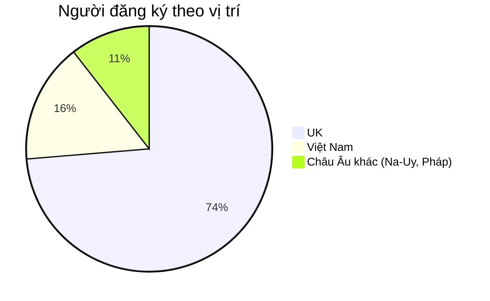
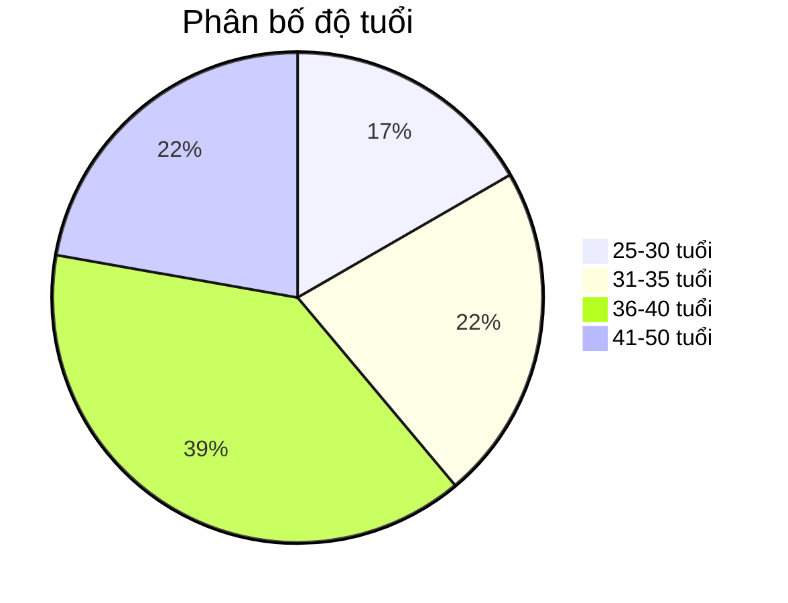
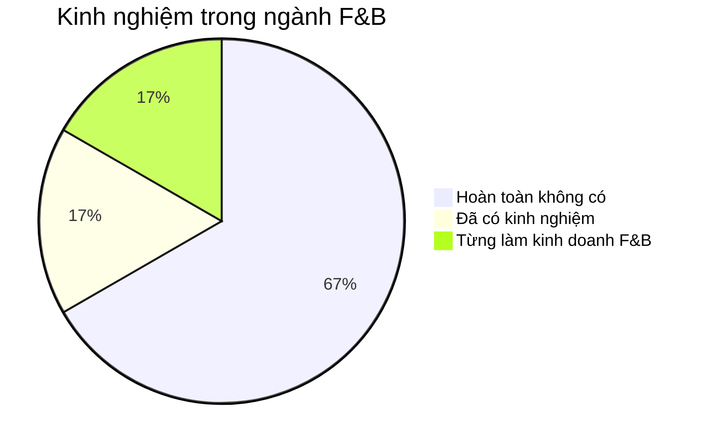
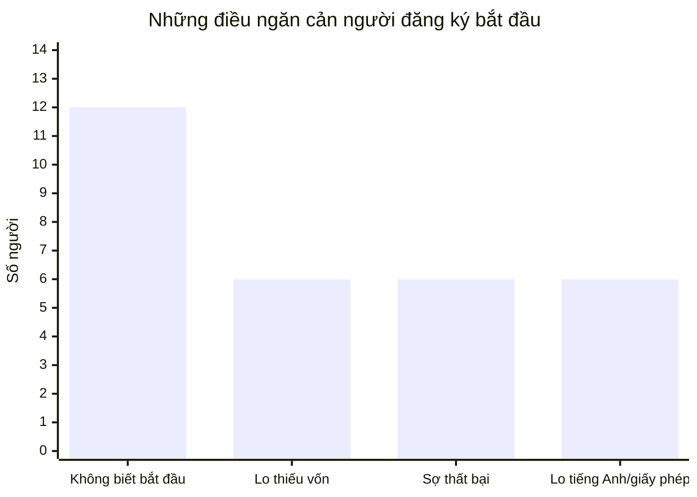
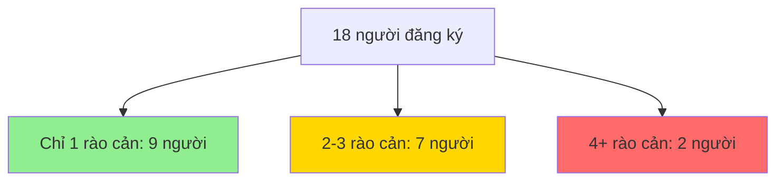
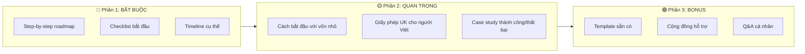
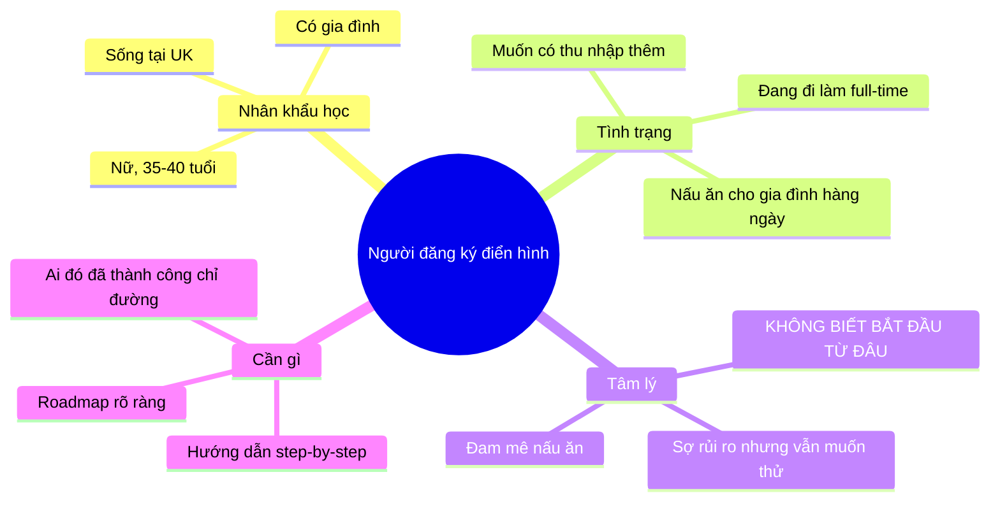

# Workshop "Từ Đam Mê Nấu Ăn Đến Quán Đầu Tiên" - Phân Tích Insights

> **Tổng số responses:** 18 (không tính test)
> **Thời gian thu thập:** 21/02/2026 - 22/02/2026

---

## 1. Phân Bố Địa Lý

**Insight:**
- **78% từ UK** - đây là thị trường chính, nên tập trung nội dung về regulations, giấy phép tại UK
- 17% từ Việt Nam - có thể mở rộng sau
- 2 người từ châu Âu khác (Na-Uy, Pháp) cho thấy tiềm năng EU market

---

## 2. Độ Tuổi Người Đăng Ký

**Insight:**
- **Nhóm 36-40 tuổi chiếm đa số (39%)** - đây là độ tuổi có kinh nghiệm sống, có gia đình, muốn tìm nguồn thu nhập phụ hoặc thay đổi sự nghiệp
- Nhóm 31-35 và 41-50 cũng đáng kể - cho thấy workshop phù hợp với người đã đi làm lâu năm
- Người trẻ 25-30: có thể đang tìm kiếm hướng đi mới

---

## 3. Kinh Nghiệm F&B

**Insight:**
- **67% CHƯA CÓ KINH NGHIỆM** - Đây là thông tin QUAN TRỌNG NHẤT
  - Workshop cần bắt đầu từ cơ bản, step-by-step
  - Không giả định họ biết gì về F&B
  - Cần giải thích từ A-Z
- 33% đã có kinh nghiệm hoặc từng làm F&B - họ đến để học cách làm "đúng hơn" hoặc restart

---

## 4. Rào Cản Chính (Barriers)

### Chi tiết phân tích rào cản:

| Rào cản | Số người | % | Mức độ ưu tiên |
|---------|----------|---|----------------|
| **Không biết bắt đầu từ đâu** | 12 | 67% | 🔴 CAO NHẤT |
| Lo sợ không đủ vốn | 6 | 33% | 🟡 TRUNG BÌNH |
| Sợ mất tiền, thất bại | 6 | 33% | 🟡 TRUNG BÌNH |
| Tiếng Anh + giấy phép | 6 | 33% | 🟡 TRUNG BÌNH |

**Insight quan trọng:**
1. **"Không biết bắt đầu từ đâu" là RÀO CẢN SỐ 1** (67%)
   - Workshop PHẢI có roadmap rõ ràng
   - Cần có checklist cụ thể cho từng bước
   - Action steps phải chi tiết

2. **Vốn không phải vấn đề lớn nhất** - chỉ 33% lo về vốn
   - Nhưng vẫn cần address, có thể nói về cách bắt đầu với vốn nhỏ

3. **Sợ thất bại = Cần case studies thành công**
   - Chia sẻ câu chuyện thất bại và cách vượt qua của Uyên sẽ rất hiệu quả

4. **Lo ngại tiếng Anh & giấy phép** - 33%
   - Cần có section riêng về regulations tại UK
   - Có thể cung cấp template/checklist tiếng Việt

---

## 5. Nhiều Rào Cản Cùng Lúc

**Insight:**
- 50% chỉ có 1 rào cản chính - dễ giải quyết
- 39% có 2-3 rào cản - cần workshop toàn diện
- 11% có nhiều rào cản - cần support thêm sau workshop

---

## 6. Gợi Ý Nội Dung Workshop

### Dựa trên data, workshop nên cover:

### Đề xuất outline workshop:

1. **Opening (10 mins)**
   - Câu chuyện của Uyên - 10 năm thăng trầm
   - Những lần thất bại và cách đứng dậy

2. **Module 1: Roadmap từ A-Z (30 mins)** 🔴
   - Bước 1: Validate ý tưởng
   - Bước 2: Test market nhỏ
   - Bước 3: Setup cơ bản
   - Bước 4: Scale dần

3. **Module 2: Bắt đầu với vốn nhỏ (15 mins)** 🟡
   - Minimum viable setup
   - Chi phí thực tế

4. **Module 3: Giấy phép & Thủ tục UK (15 mins)** 🟡
   - Food Hygiene Certificate
   - Register food business
   - Insurance cơ bản

5. **Q&A Session (20 mins)**

---

## 7. Profile Người Đăng Ký Điển Hình

---

## 8. Key Takeaways cho Workshop

| # | Insight | Action |
|---|---------|--------|
| 1 | 67% không biết bắt đầu từ đâu | **Tạo roadmap chi tiết, có checklist download** |
| 2 | 67% chưa có kinh nghiệm F&B | **Giải thích từ cơ bản nhất, không dùng jargon** |
| 3 | 78% sống ở UK | **Focus vào regulations UK, có template tiếng Việt** |
| 4 | 33% lo thiếu vốn | **Chia sẻ cách bắt đầu với < £500** |
| 5 | 33% sợ thất bại | **Chia sẻ câu chuyện thất bại thật của Uyên** |
| 6 | Độ tuổi 35-40 là chủ đạo | **Họ có trách nhiệm gia đình - cần cách làm an toàn** |

---

## 9. Suggested Follow-up Actions

- [ ] Tạo checklist PDF "10 bước bắt đầu kinh doanh F&B tại UK"
- [ ] Chuẩn bị template đăng ký food business
- [ ] Chuẩn bị 2-3 case studies (1 thành công, 1 thất bại và phục hồi)
- [ ] Setup Facebook group cho attendees
- [ ] Chuẩn bị slide với visual nhiều, text ít
- [ ] Có Q&A form trước workshop để trả lời targeted hơn

---

*Phân tích được tạo ngày: 22/02/2026*
